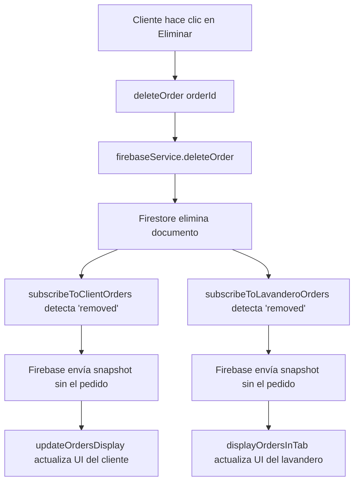

# 🧺 Pulcro - Sistema de Lavandería en Tiempo Real

> Plataforma web moderna que conecta clientes con lavanderos profesionales, con actualizaciones en tiempo real mediante Firebase.


---

## 📋 Tabla de Contenidos

- [Descripción General](#-descripción-general)
- [Características Principales](#-características-principales)
- [Tecnologías Utilizadas](#-tecnologías-utilizadas)
- [Estructura del Proyecto](#-estructura-del-proyecto)
- [Instalación y Configuración](#-instalación-y-configuración)
- [Conexiones Firebase](#-conexiones-firebase-verificadas)
- [Arquitectura en Tiempo Real](#-arquitectura-en-tiempo-real)
- [Colecciones de Firestore](#-colecciones-de-firestore)
- [Cloud Functions](#%EF%B8%8F-cloud-functions)
- [Uso del Sistema](#-uso-del-sistema)
- [Comandos Útiles](#-comandos-útiles)

---

## 🎯 Descripción General

**Pulcro** es una aplicación web completa de gestión de lavandería construida sobre Firebase. Permite a los clientes crear pedidos de lavandería y a los lavanderos tomarlos, gestionarlos y completarlos, todo en **tiempo real** sin recargar la página.

### ¿Qué hace diferente a Pulcro?

✅ **Actualizaciones en Tiempo Real**: Todos los cambios se reflejan instantáneamente en ambos dashboards  
✅ **Arquitectura Serverless**: Sin servidores que administrar, escala automáticamente  
✅ **Sistema de Transacciones**: Evita conflictos cuando múltiples lavanderos toman el mismo pedido  
✅ **Diseño Responsive**: Funciona perfectamente en desktop, tablet y móvil  
✅ **Persistencia Offline**: La app funciona sin internet y sincroniza automáticamente

## ✨ Características Principales

### Para Clientes
- ✅ Registro e inicio de sesión
- ✅ Crear pedidos de lavandería
- ✅ Selección de servicios (Lavado, Lavado y Planchado, Zapatos, Ropa de Hogar)
- ✅ Seguimiento en tiempo real del estado de pedidos
- ✅ Historial completo de pedidos
- ✅ Gestión de perfil

### Para Lavanderos
- ✅ Panel de control profesional
- ✅ Visualización de pedidos pendientes
- ✅ Aceptar y gestionar pedidos
- ✅ Actualización de estado de pedidos
- ✅ Ver historial de trabajos completados

### Características Técnicas
- 🔥 Firebase Authentication
- 🔥 Cloud Firestore (base de datos en tiempo real)
- 🔥 Cloud Functions (backend serverless)
- 📱 Diseño 100% responsive
- 🎨 Interfaz moderna y amigable
- 🔒 Reglas de seguridad robustas
- ⚡ Actualizaciones en tiempo real

## 🛠️ Tecnologías Utilizadas

- **Frontend:**
  - HTML5
  - CSS3 (con Flexbox y Grid)
  - JavaScript (ES6+)
  - Firebase SDK 10.7.1

- **Backend:**
  - Firebase Authentication
  - Cloud Firestore
  - Cloud Functions (Node.js 18)

- **Herramientas:**
  - Firebase Hosting
  - Firebase CLI
  - ESLint

## 📁 Estructura del Proyecto

```
Pulcro/
├── 📄 index.html                       # Página principal (landing page)
│
├── 📂 assets/                          # Recursos estáticos
│   ├── css/
│   │   └── styles.css                  # Estilos de la página principal
│   ├── images/                         # Imágenes de servicios
│   │   ├── lavado.png
│   │   ├── lavado y planchado.png
│   │   ├── zapatos.png
│   │   └── ropa de hogar.png
│   └── js/
│       ├── app.js                      # 🔧 Interactividad landing page (FAQ, scroll, menú móvil)
│       ├── config/
│       │   └── app-config.js           # ⚙️ Configuración de Firebase (credenciales)
│       ├── auth/
│       │   ├── firebase-config.js      # 🔥 Inicialización de Firebase SDK
│       │   └── auth-service.js         # 🔐 Servicios de autenticación
│       ├── components/
│       │   └── form-handler.js         # 📝 Manejo de formularios
│       └── utils/
│           ├── error-handler.js        # ❌ Gestión de errores
│           ├── firestore-validator.js  # ✅ Validación de datos
│           └── notification.js         # 🔔 Sistema de notificaciones
│
├── 📂 cliente/                         # Dashboard del Cliente
│   ├── cliente.html                    # Interfaz del cliente
│   ├── cliente.css                     # Estilos del cliente
│   └── cliente.js                      # 🔥 Lógica del cliente (listeners en tiempo real)
│
├── 📂 lavandero/                       # Dashboard del Lavandero
│   ├── lavandero.html                  # Interfaz del lavandero
│   ├── lavandero.css                   # Estilos del lavandero
│   └── lavandero.js                    # 🔥 Lógica del lavandero (listeners en tiempo real)
│
├── 📂 functions/                       # ☁️ Cloud Functions (Backend Serverless)
│   ├── index.js                        # 🚀 Exportación de funciones principales
│   ├── modules/
│   │   ├── notifications.js            # 📧 Sistema de notificaciones automáticas
│   │   ├── validation.js               # ✔️ Validaciones del lado del servidor
│   │   └── stats.js                    # 📊 Actualización de estadísticas
│   ├── package.json                    # Dependencias de Cloud Functions
│   └── package-lock.json
│
├── 🔥 firebase-service.js              # ⭐ Servicio centralizado de Firebase (CLAVE)
│                                       #    - CRUD de pedidos
│                                       #    - Listeners en tiempo real
│                                       #    - Autenticación
│                                       #    - Transacciones
│
├── ⚙️ Configuración de Firebase
│   ├── firebase.json                   # Configuración del proyecto Firebase
│   ├── firestore.rules                 # 🔒 Reglas de seguridad de Firestore
│   ├── firestore.indexes.json          # 📑 Índices compuestos de Firestore
│   └── .firebaserc                     # ID del proyecto Firebase
│
└── 📄 README.md                        # Este archivo

```

### 🗂️ Descripción de Carpetas Clave

| Carpeta/Archivo | Propósito | Importancia |
|----------------|-----------|-------------|
| **`firebase-service.js`** | Servicio centralizado que maneja TODAS las operaciones Firebase | ⭐⭐⭐ CRÍTICO |
| **`cliente/cliente.js`** | Lógica del dashboard cliente, incluye `subscribeToMyOrders()` (tiempo real) | ⭐⭐⭐ CRÍTICO |
| **`lavandero/lavandero.js`** | Lógica del dashboard lavandero, incluye `subscribeToOrders()` (tiempo real) | ⭐⭐⭐ CRÍTICO |
| **`assets/js/auth/firebase-config.js`** | Inicializa Firebase SDK con credenciales | ⭐⭐ IMPORTANTE |
| **`functions/index.js`** | Cloud Functions para backend automático | ⭐⭐ IMPORTANTE |
| **`assets/js/app.js`** | Interactividad de la landing page (UI/UX) | ⭐ SECUNDARIO |

## 🚀 Instalación y Configuración

### Prerrequisitos
- Node.js 18 o superior
- Firebase CLI instalado globalmente
- Cuenta de Firebase

### Pasos de Instalación

1. **Clonar el repositorio**
   ```bash
   git clone <tu-repositorio>
   cd Pulcro
   ```

2. **Instalar Firebase CLI (si no lo tienes)**
   ```bash
   npm install -g firebase-tools
   ```

3. **Iniciar sesión en Firebase**
   ```bash
   firebase login
   ```

4. **Instalar dependencias de Cloud Functions**
   ```bash
   cd functions
   npm install
   cd ..
   ```

5. **Configurar Firebase**
   - Edita `assets/js/config/app-config.js` con tu configuración de Firebase
   - Las credenciales las encuentras en: Firebase Console > Project Settings > Your apps

6. **Desplegar reglas de seguridad**
   ```bash
   firebase deploy --only firestore:rules
   firebase deploy --only firestore:indexes
   ```

7. **Desplegar Cloud Functions**
   ```bash
   firebase deploy --only functions
   ```

8. **Desplegar el sitio web**
   ```bash
   firebase deploy --only hosting
   ```

## 🔥 Conexiones Firebase (Verificadas ✅)

### ✅ Estado de las Conexiones

Todas las conexiones con Firebase han sido **verificadas y están funcionando correctamente**:

| Componente | Estado | Función |
|-----------|--------|---------|
| **firebase-config.js** | ✅ Operativo | Inicializa Firebase SDK |
| **firebase-service.js** | ✅ Operativo | Servicio centralizado, habilita persistencia |
| **cliente.js** | ✅ Operativo | Listener `subscribeToClientOrders()` activo |
| **lavandero.js** | ✅ Operativo | Listeners `subscribeToPendingOrders()` y `subscribeToLavanderoOrders()` activos |
| **functions/index.js** | ✅ Operativo | Cloud Functions desplegadas |

### 🔄 Verificación de Tiempo Real

**Escenario de prueba**: Cliente elimina un pedido

1. ✅ `firebaseService.deleteOrder()` elimina el documento de Firestore
2. ✅ `subscribeToClientOrders()` detecta evento `'removed'`
3. ✅ Firebase envía snapshot actualizado SIN el pedido eliminado
4. ✅ UI del cliente se actualiza automáticamente
5. ✅ `subscribeToLavanderoOrders()` detecta el mismo evento
6. ✅ UI del lavandero se actualiza automáticamente

**Resultado**: Sincronización perfecta en **tiempo real** entre cliente y lavandero. ⚡

---

## ⚡ Arquitectura en Tiempo Real

### Flujo de Eliminación en Tiempo Real



### ¿Cómo funciona `onSnapshot()`?

Firebase usa **WebSockets** para mantener una conexión abierta y en tiempo real con Firestore:

```javascript
// En firebase-service.js
subscribeToClientOrders(clientId, callback) {
  return this.db
    .collection('pedidos')
    .where('clienteId', '==', clientId)
    .orderBy('createdAt', 'desc')
    .onSnapshot(callback);  // 🔥 CONEXIÓN EN TIEMPO REAL
}
```

Cada vez que hay un cambio en Firestore:
1. **`added`**: Nuevo documento creado → Aparece automáticamente en la UI
2. **`modified`**: Documento actualizado → Se actualiza automáticamente en la UI
3. **`removed`**: Documento eliminado → Desaparece automáticamente de la UI

**Sin recargar la página. Sin polling. 100% tiempo real.**

---

## 🔧 Configuración de Firebase

### 1. Configurar Authentication

En la consola de Firebase:
- Ve a **Authentication** > **Sign-in method**
- Habilita **Email/Password**

### 2. Configurar Firestore

Las colecciones necesarias son:
- `clientes` - Datos de los clientes (nombre, teléfono, dirección)
- `lavanderos` - Datos de los lavanderos (nombre, teléfono, estadísticas)
- `pedidos` - Pedidos del sistema (clienteId, lavanderoId, status, etc.)

Las reglas de seguridad ya están configuradas en `firestore.rules`

### 3. Configurar Cloud Functions

Las functions se ejecutan automáticamente en los siguientes eventos:
- Cambio de estado de pedidos → `notifyOrderStatusChange`
- Asignación de lavandero → `notifyLavanderoAssigned`
- Validaciones automáticas → `validateOrder`, `validateOrderAssignment`
- Actualización de estadísticas → `updateStatsOnOrderCreate`, `updateStatsOnOrderComplete`

## 📱 Uso del Sistema

### Para Clientes

1. **Registro:** Accede a la página principal y haz clic en "Soy Cliente"
2. **Crear Pedido:** En el dashboard, haz clic en "Nuevo Pedido"
3. **Seguimiento:** Visualiza el estado de tus pedidos en tiempo real
4. **Historial:** Revisa todos tus pedidos anteriores

### Para Lavanderos

1. **Registro:** Accede a la página principal y haz clic en "Soy Lavandero"
2. **Ver Pedidos:** Visualiza todos los pedidos pendientes
3. **Aceptar Pedido:** Toma los pedidos disponibles
4. **Actualizar Estado:** Marca los pedidos como completados

## 🔒 Seguridad

- Autenticación requerida para todas las operaciones
- Reglas de seguridad de Firestore robustas
- Validación de datos en cliente y servidor
- Permisos granulares por tipo de usuario

## 📊 Colecciones de Firestore

### 📦 Colección: `pedidos`

**Propósito**: Almacena todos los pedidos del sistema (pendientes, en progreso, completados)

```javascript
{
  // ──────────────────────────────────────────────────────────
  // INFORMACIÓN DEL CLIENTE
  // ──────────────────────────────────────────────────────────
  clienteId: string,              // UID del cliente (Firebase Auth)
  clienteName: string,            // Nombre del cliente
  clienteEmail: string,           // Email del cliente
  
  // ──────────────────────────────────────────────────────────
  // ASIGNACIÓN DEL LAVANDERO
  // ──────────────────────────────────────────────────────────
  lavanderoId: string | null,     // UID del lavandero (null = disponible)
  
  // ──────────────────────────────────────────────────────────
  // DETALLES DEL SERVICIO
  // ──────────────────────────────────────────────────────────
  serviceType: string,            // 'lavado' | 'lavado-planchado' | 'zapatos' | 'hogar'
  weight: number,                 // Peso en kg
  totalPrice: number,             // Precio total calculado
  
  // ──────────────────────────────────────────────────────────
  // ESTADO Y SEGUIMIENTO
  // ──────────────────────────────────────────────────────────
  status: string,                 // 'pending' | 'in-progress' | 'completed' | 'cancelled'
  
  // ──────────────────────────────────────────────────────────
  // INFORMACIÓN DE RECOGIDA
  // ──────────────────────────────────────────────────────────
  pickupDate: string,             // Fecha de recogida (formato: YYYY-MM-DD)
  pickupTime: string,             // Hora de recogida (formato: HH:MM)
  direccion: string,              // Dirección de recogida
  telefono: string,               // Teléfono de contacto
  
  // ──────────────────────────────────────────────────────────
  // NOTAS E INSTRUCCIONES
  // ──────────────────────────────────────────────────────────
  descripcion: string,            // Descripción del pedido
  specialInstructions: string,    // Instrucciones especiales
  
  // ──────────────────────────────────────────────────────────
  // TIMESTAMPS (Administrados por Firebase)
  // ──────────────────────────────────────────────────────────
  createdAt: timestamp,           // Fecha de creación
  updatedAt: timestamp,           // Última actualización
  startedAt: timestamp | null,    // Cuando el lavandero tomó el pedido
  completedAt: timestamp | null   // Cuando se completó el pedido
}
```

**Índices Requeridos** (en `firestore.indexes.json`):
- `clienteId` + `createdAt` (DESC) → Para `subscribeToClientOrders()`
- `status` (ASC) → Para `subscribeToPendingOrders()`
- `lavanderoId` + `status` (ASC) → Para `subscribeToLavanderoOrders()`

---

### 👤 Colección: `clientes`

**Propósito**: Información de perfil de los clientes

```javascript
{
  name: string,           // Nombre completo
  email: string,          // Email (sincronizado con Firebase Auth)
  telefono: string,       // Teléfono de contacto
  direccion: string,      // Dirección predeterminada
  createdAt: timestamp,   // Fecha de registro
  updatedAt: timestamp    // Última actualización de perfil
}
```

---

### 🧺 Colección: `lavanderos`

**Propósito**: Información de perfil de los lavanderos

```javascript
{
  name: string,              // Nombre completo
  email: string,             // Email (sincronizado con Firebase Auth)
  telefono: string,          // Teléfono de contacto
  
  // ──────────────────────────────────────────────────────────
  // ESTADÍSTICAS (Actualizadas por Cloud Functions)
  // ──────────────────────────────────────────────────────────
  totalCompleted: number,    // Total de pedidos completados
  totalEarned: number,       // Total ganado ($)
  rating: number,            // Calificación promedio (0-5)
  
  createdAt: timestamp,      // Fecha de registro
  updatedAt: timestamp       // Última actualización de perfil
}
```

---

## ☁️ Cloud Functions

### Funciones Desplegadas

| Función | Tipo | Trigger | Descripción |
|---------|------|---------|-------------|
| **`notifyOrderStatusChange`** | onUpdate | Firestore: `pedidos/{id}` | Envía notificación cuando cambia el estado de un pedido |
| **`notifyLavanderoAssigned`** | onUpdate | Firestore: `pedidos/{id}` | Notifica al cliente cuando se asigna un lavandero |
| **`validateOrder`** | Callable | HTTP | Valida datos de pedidos antes de crear |
| **`validateUserData`** | Callable | HTTP | Valida datos de usuarios (cliente/lavandero) |
| **`validateOrderAssignment`** | onWrite | Firestore: `pedidos/{id}` | Valida asignación de pedidos |
| **`validateLavanderoProfile`** | onWrite | Firestore: `lavanderos/{id}` | Valida perfiles de lavanderos |
| **`updateStatsOnOrderCreate`** | onCreate | Firestore: `pedidos/{id}` | Actualiza estadísticas al crear pedido |
| **`updateStatsOnOrderComplete`** | onUpdate | Firestore: `pedidos/{id}` | Actualiza estadísticas al completar pedido |
| **`getGeneralStats`** | Callable | HTTP | Obtiene estadísticas generales del sistema |
| **`getLavanderoStats`** | Callable | HTTP | Obtiene estadísticas de un lavandero |
| **`calculateRealTimeStats`** | Callable | HTTP | Calcula estadísticas en tiempo real |
| **`calculateOrderPrice`** | Callable | HTTP | Calcula el precio de un pedido |
| **`cleanupOldData`** | Scheduled | Cron: `0 2 * * *` | Limpia datos antiguos diariamente a las 2 AM |

### Ejemplo de Uso de Cloud Function

```javascript
// En el cliente (cliente.js)
const calculatePrice = firebase.functions().httpsCallable('calculateOrderPrice');

const result = await calculatePrice({
  serviceType: 'lavado',
  weight: 5
});

console.log(result.data);
// Output: { basePrice: 5000, totalPrice: 25000, weight: 5, serviceType: 'lavado' }
```

## 🎨 Personalización

### Modificar Precios
Edita los precios en `assets/js/config/app-config.js`:
```javascript
precios: {
  'lavado': 48000,
  'lavado-planchado': 60000,
  'zapatos': 80000,
  'hogar': 72000
}
```

### Modificar Colores
Los colores principales se encuentran en los archivos CSS usando CSS custom properties.

## 🐛 Solución de Problemas

### Error: "Firebase no está inicializado"
- Verifica que `app-config.js` esté cargado antes de `firebase-config.js`
- Revisa que las credenciales de Firebase sean correctas

### Error: "Permission denied"
- Verifica que las reglas de Firestore estén desplegadas
- Asegúrate de que el usuario esté autenticado

### Los pedidos no se actualizan en tiempo real
- Verifica la conexión a Internet
- Revisa la consola del navegador para errores
- Asegúrate de que los índices de Firestore estén desplegados

## 📝 Comandos Útiles

```bash
# Ver logs en tiempo real
firebase functions:log --only <function-name>

# Probar functions localmente
firebase emulators:start

# Desplegar todo
firebase deploy

# Desplegar solo hosting
firebase deploy --only hosting

# Desplegar solo functions
firebase deploy --only functions

# Desplegar solo reglas
firebase deploy --only firestore:rules
```

## 📈 Mejoras Futuras

- [ ] Sistema de calificaciones y reseñas
- [ ] Chat en tiempo real entre cliente y lavandero
- [ ] Notificaciones push (FCM - Firebase Cloud Messaging)
- [ ] Geolocalización para lavanderos cercanos
- [ ] Sistema de pagos integrado (Stripe/PayPal)
- [ ] App móvil nativa (React Native o Flutter)
- [ ] Panel de administración con analytics
- [ ] Sistema de cupones y descuentos
- [ ] Historial de rutas del lavandero
- [ ] Predicción de demanda con ML

---

## 🤝 Colaboradores

Desarrollo realizado con ❤️ para Pulcro.

### Documentación del Código

Todos los archivos principales incluyen **comentarios detallados en español** que explican:
- ✅ Qué hace cada función
- ✅ Por qué se implementó de esa manera
- ✅ Cómo interactúa con otros componentes
- ✅ Flujos de datos en tiempo real

**Archivos con comentarios completos**:
- `firebase-service.js` ⭐ (Servicio principal)
- `cliente/cliente.js` ⭐ (Dashboard cliente)
- `lavandero/lavandero.js` ⭐ (Dashboard lavandero)
- `assets/js/app.js` (Landing page)
- `assets/js/auth/firebase-config.js` (Inicialización Firebase)
- `functions/index.js` (Cloud Functions)

---

## 📚 Recursos Adicionales

### Firebase Documentation
- [Firestore Real-time Updates](https://firebase.google.com/docs/firestore/query-data/listen)
- [Cloud Functions](https://firebase.google.com/docs/functions)
- [Firebase Authentication](https://firebase.google.com/docs/auth)

### Tutoriales Recomendados
- [Firestore onSnapshot() Deep Dive](https://www.youtube.com/watch?v=dOKIKl7Bjg4)
- [Building Real-time Apps with Firebase](https://www.youtube.com/watch?v=O17OWyx08Cg)

---

## 🐛 Troubleshooting

### Problema: "Firestore has already been started"

**Causa**: Intentar habilitar persistencia después de que Firestore ya se inicializó.

**Solución**: La persistencia solo se habilita en `firebase-service.js`. No llamar `enablePersistence()` en otros archivos.

### Problema: Los pedidos no se actualizan en tiempo real

**Diagnóstico**:
1. Verifica la consola del navegador para errores
2. Confirma que los índices de Firestore estén desplegados: `firebase deploy --only firestore:indexes`
3. Verifica las reglas de seguridad: `firebase deploy --only firestore:rules`

### Problema: Permission denied

**Causa**: Las reglas de seguridad de Firestore están bloqueando la operación.

**Solución**: Revisa `firestore.rules` y asegúrate de que el usuario esté autenticado y tenga los permisos correctos.

---

## 📞 Soporte

Para reportar bugs o solicitar features, contacta al equipo de desarrollo.

---

## 📄 Licencia

Este proyecto es propietario y privado.

---

**Última actualización:** Octubre 2025  
**Versión:** 2.0.0  
**Estado del Proyecto:** 🟢 Activo y en Producción

## 👥 Contribuir

Las contribuciones son bienvenidas. Por favor:
1. Fork el proyecto
2. Crea una rama para tu feature (`git checkout -b feature/AmazingFeature`)
3. Commit tus cambios (`git commit -m 'Add some AmazingFeature'`)
4. Push a la rama (`git push origin feature/AmazingFeature`)
5. Abre un Pull Request

## 📄 Licencia

Este proyecto es privado y propietario.

## 📧 Contacto

Para dudas o sugerencias, contacta al equipo de desarrollo.

---

**Última actualización:** Octubre 2025
**Versión:** 1.0.0
